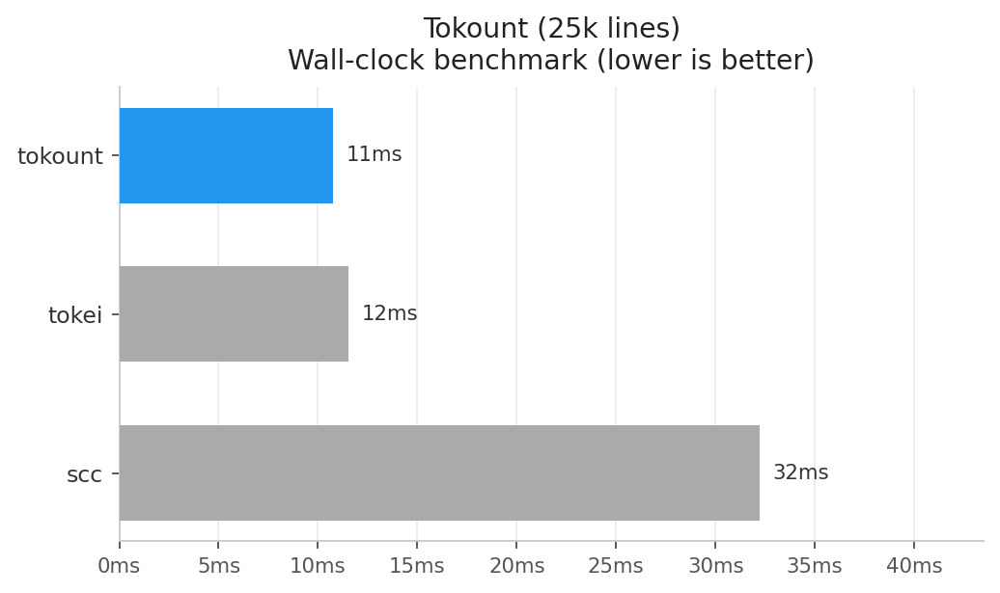
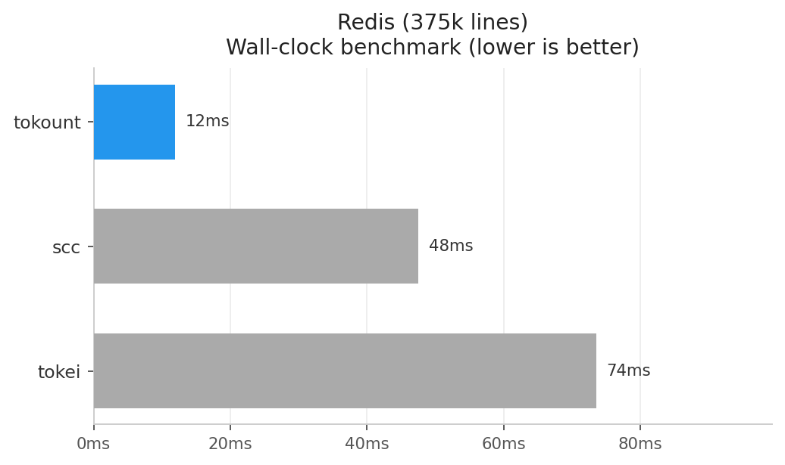
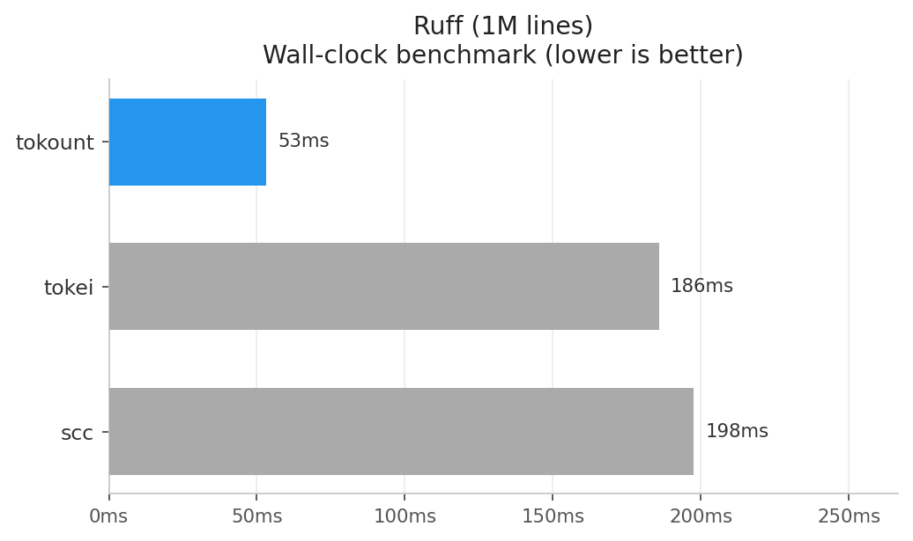
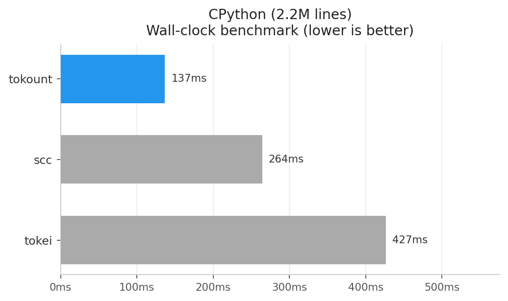
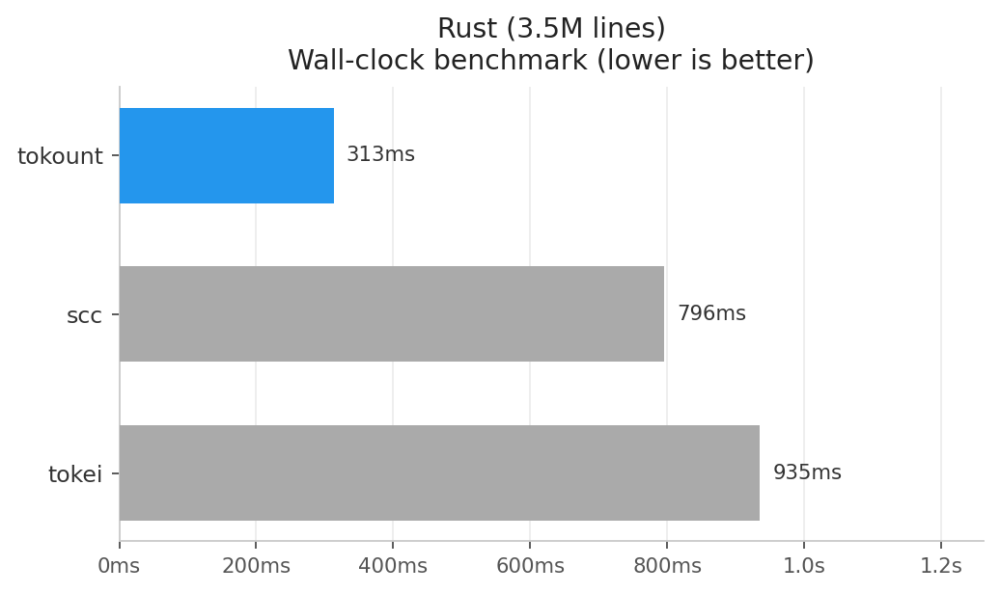
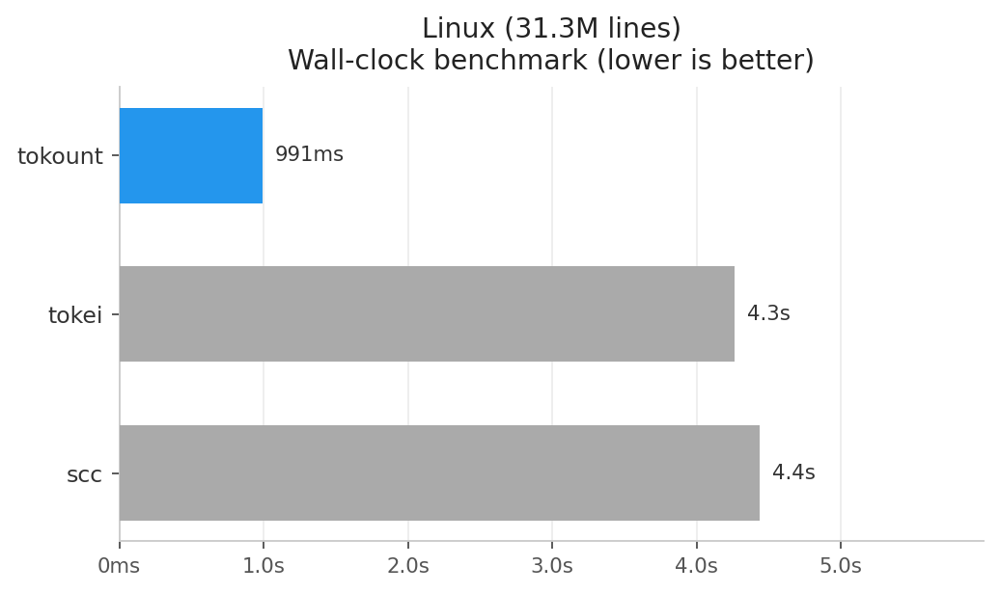

  <h1>Changelog</h1>

  <h3>All notable changes to tokount</h3>

  
Table of Contents

  <ol>
    <li><a href="#v200--simd-engine">v2.0.0</a></li>
    <li><a href="#v111--windows-symlink-guard">v1.1.1</a></li>
    <li><a href="#v110--human-readable-output--multi-path-support">v1.1.0</a></li>
    <li><a href="#v101--maintenance">v1.0.1</a></li>
    <li><a href="#v100--initial-release">v1.0.0</a></li>
  </ol>

## v2.0.0 — SIMD engine

Complete rewrite of the counting engine. Replaced `tokei` with a custom byte-level FSM and SIMD-accelerated scanning, making tokount the fastest line counter available.

**New stuff:**

- Custom byte-level finite state machine (FSM) replaces tokei dependency entirely
- SIMD-accelerated byte scanning via `memchr` (SSE2/AVX2 under the hood)
- Language definitions generated at compile time from a merged scc/tokei/cloc database (475+ languages)
- `ignore`-crate parallel walker (same engine as ripgrep) replaces `walkdir`
- Thread-local `FileReader` with buffer reuse — zero heap allocation in the hot path
- Hybrid I/O: mmap for files >64KB (zero-copy), buffered read for small files
- `crossbeam_channel::unbounded` + `rayon::par_bridge` streaming pipeline
- Git-aware ignore logic: uses `.gitignore` in git repos, adds `.prettierignore` support everywhere
- `-o`/`--output` — output format: `table` (default), `json`, `csv`
- `-s`/`--sort` — sort by column: `files`, `lines`, `blank`, `comment`, `code` (default: `code`)
- `-t`/`--types` — filter to specific language(s), comma-separated (e.g. `-t Rust,Python`)
- `--no-ignore` — disable `.gitignore` / `.prettierignore` respect entirely
- `-l`/`--languages` — print all 475+ supported languages and exit
- Delimiter priority: string literal and block comment openers are always tried longest-first,
  so `"""` and `'''` correctly shadow `"` / `'`. Affects 27+ languages including Python, Cangjie,
  Boo, Dart, TOML, Vala, Xtend, GraphQL, GDScript, and others.
- Cangjie `##"..."##` raw strings added as a raw string type (no escape processing)
- F# string literals: `"..."`, `@"..."` (verbatim/raw), and `"""..."""` added to language definition

**Changed:**

- `opt-level` changed from `"z"` (size) to `3` (speed) (enables SIMD auto-vectorization)
- Removed `tokei` and `walkdir` dependencies
- `src/git.rs` removed; git repo counting and ignore collection are now part of the engine walker
- `src/analyze.rs` removed; engine called directly from `main.rs`
- `--json`/`-j` removed; use `--output json` / `-o json` instead

**Benchmarks:**

All benchmarks were run on an Intel Core i7-8650U @ 1.90GHz with 16 GB RAM running Artix Linux, using [hyperfine](https://github.com/sharkdp/hyperfine) (`--warmup 3 --runs 5`).

You can reproduce the tests locally with `./benchmark.sh` but your mileage may vary.

<table>
  <tr>
    <td></td>
    <td></td>
    <td></td>
  </tr>
  <tr>
    <td></td>
    <td></td>
    <td></td>
  </tr>
</table>

> **Note:** At 25k lines all tools finish in under 20ms and timing noise dominates. The trend becomes clear from Redis onwards.

(<a href="#changelog-top">back to top</a>)

---

## v1.1.1 — Windows symlink guard

**Changed:**

- `-L`/`--follow-symlinks` now exits with an error on Windows (unsupported platform)

(<a href="#changelog-top">back to top</a>)

---

## v1.1.0 — Human-readable output & multi-path support

**New stuff:**

- Human-readable table by default with timing stats (files/s, lines/s), file count, and git repo count
- `--json` / `-j` flag for machine-readable JSON output (replaces old default behaviour)
- Spinner progress indicator during scan; suppressed automatically when piping or using `--json`
- Multiple path arguments: `tokount file1 file2 dir/` and `tokount $(git ls-files)`
- Integration test suite with fixture directories and JSON snapshots

**Changed:**

- Excluded dirs are now a named flag `-e`/`--excluded` instead of a positional arg (breaking change)
- Fixed `homepage` and `repository` in `Cargo.toml` pointing to wrong repo

(<a href="#changelog-top">back to top</a>)

---

## v1.0.1 — Maintenance

**New stuff:**

- `.editorconfig`, `rustfmt.toml`, `clippy.toml`, `rust-toolchain.toml` for consistent formatting and lint configuration
- `.prettierrc` for YAML/JSON/TOML/Markdown formatting

**Changed:**

- `clap` bumped from 4.5.55 to 4.5.59
- `extract-changelog.sh` renamed to `extract_changelog.sh`

(<a href="#changelog-top">back to top</a>)

---

## v1.0.0 — Initial release

First version. A fast line counter for codebases, powered by `tokei`

**New stuff:**

- JSON output format with per-language stats (files, blank, comment, code)
- Structured JSON error output to stderr
- Support for excluding directories via comma-separated list
- Symlink following with `-L`/`--follow-symlinks` flag
- Git repository detection
- Gitignore pattern collection
- CLI argument parsing with `clap` derive macros

(<a href="#changelog-top">back to top</a>)

---

  
Back to <a href="README.md">README</a>?

